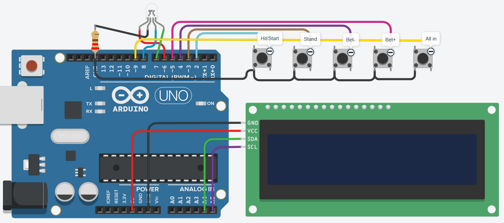

# Arduino Blackjack

Simple Blackjack game implemented on an Arduino with an I2C LCD display, RGB LED, and physical buttons for interaction.

---

## Overview

This project recreates a playable version of **Blackjack** using basic electronic components.

---

## Components

| Component              | Quantity|
|------------------------|-----------|
| Arduino (Uno/Nano/etc) | 1 |
| LCD 16x2 (I2C)         | 1 |
| Push Buttons           | 5 | 
| RGB LED | 1 | 
| Resistors (220Ω)  | 1 | 
| Breadboard + wires     | 1 | 

---

## Pin Configuration

| Function         | Pin |
|------------------|-----|
| Hit              | 2 |
| Stand            | 3 |
| Bet Down         | 4 |
| Bet Up           | 5 |
| All In           | 9 |
| RGB LED Red      | 6 |
| RGB LED Green    | 7 |
| RGB LED Blue     | 8 |
| LCD SDA          | A4 |
| LCD SCL          | A5 |
---

## Game Controls

| Button | Action |
|---------|--------|
| **BET UP / DOWN** | Adjust bet amount in increments of 25 |
| **ALL IN** | Bet the entire balance |
| **HIT** | During betting phase: start round. During play: draw a card |
| **STAND** | End player turn, let dealer play |
| **HIT (Game Over)** | Restart after balance reaches 0 |

---

## LED Indicators

| Color | Meaning |
|--------|----------|
| Red | Player lost |
| Green | Player won |
| Yellow | Tie|

---
## Notes

- If the LCD displays nothing, adjust the I2C address.  
- Modify bet increments or starting balance in the code as desired.  

---
